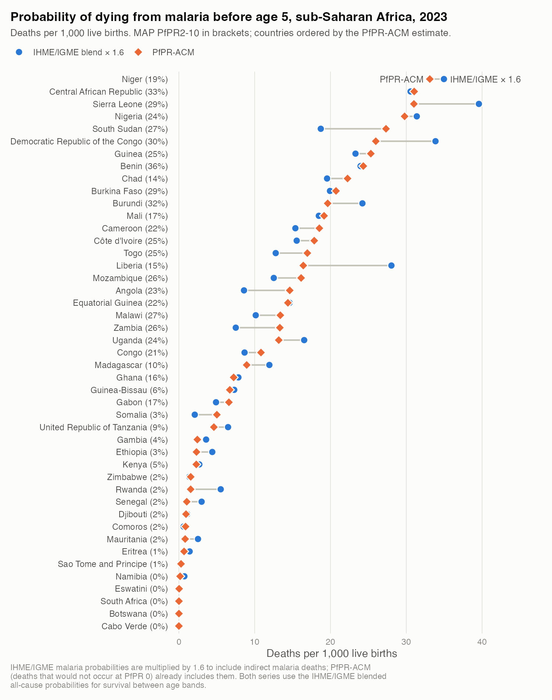
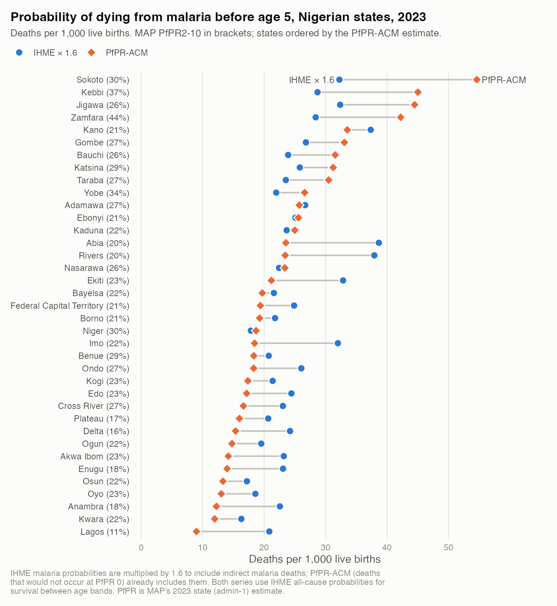

# Malaria burden inputs — sub-Saharan Africa, 2023

Shared burden inputs for GiveWell malaria intervention cost-effectiveness models, for
sub-Saharan African countries and Nigerian states. By age band, it covers:
- probability of death, all causes and malaria
- population
- live births
- malaria's share of deaths

It also has *P. falciparum* prevalence, and an in-house PfPR-based estimate of malaria
mortality (PfPR-ACM). Sources are IHME, UN IGME (with UN WPP and CA-CODE), MAP and WorldPop.

**Main file:** [`output/malaria_burden_main_2023.csv`](output/malaria_burden_main_2023.csv),
one row per country (45) and per Nigerian state (37), with 43 columns defined in
[`output/malaria_burden_main_2023_dictionary.csv`](output/malaria_burden_main_2023_dictionary.csv).
Every column is copied from the full file below. The age-band suffixes are `0_27d`, `1_5m`,
`6_11m`, `12_23m` and `2_4y`.

| Columns | Content |
|---|---|
| `location_level`, `iso3`, `country_name`, `state_name` | Location |
| `blend_live_births` | Live births |
| `blend_deaths_all_u5`, `blend_deaths_all_{band}` | All-cause deaths, under 5 and by band |
| `blend_q_all_{band}` | Probability of death, all causes |
| `blend_q_malaria_adj_{band}` | Probability of death, malaria, × 1.6 for indirect malaria deaths |
| `blend_pop_{band}` | Population |
| `blend_malaria_fraction_adj_{band}` | Share of all-cause deaths due to malaria, × 1.6 for indirect malaria deaths |
| `map_pfpr_2_10` | MAP population-weighted PfPR2–10 |
| `pfpracm_share_{band}`, `pfpracm_share_u5` | PfPR-ACM malaria share of all-cause deaths; under 5 weighted by `blend_deaths_all_{band}` |
| `combined_q_malaria_{band}` | 0.5 × `blend_q_malaria_adj` + 0.5 × PfPR-ACM malaria *q* |

All `blend_` columns average IHME and IGME/WPP for countries and use IHME only for Nigerian
states.

**Indirect deaths:** the IHME/IGME malaria share and malaria *q* count only deaths assigned to
malaria as the cause. In the main file they are multiplied by 1.6 (a 60% adjustment for
indirect malaria deaths), for every age band, country and Nigerian state. PfPR-ACM is not
adjusted, because it already counts indirect deaths. The unadjusted values (`blend_q_malaria`,
`blend_malaria_fraction`) are in the full file.

`combined_q_malaria` is therefore 0.5 × (1.6 × IHME/IGME blend) + 0.5 × PfPR-ACM for countries,
and 0.5 × (1.6 × IHME) + 0.5 × PfPR-ACM for states.

The main file has no blank cells. Lesotho, Mauritius and Seychelles are left out of every
output file (see Coverage).

**Full file:** [`output/malaria_burden_inputs_2023.csv`](output/malaria_burden_inputs_2023.csv),
the same rows with all 179 columns: every source on the five bands, uncertainty bounds and the
sources as published. Every column is defined in
[`output/data_dictionary.csv`](output/data_dictionary.csv).

The same band-level values are in long form, one row per location and age band (82 × 5), in
[`output/burden_by_age_band_2023.csv`](output/burden_by_age_band_2023.csv). The long file uses
these columns:

| Long-file column | Wide-file column | Note |
|---|---|---|
| `{source}_population` | `{source}_pop_{band}` | |
| `{source}_q_all` | `{source}_q_all_{band}` | |
| `{source}_q_malaria` | `{source}_q_malaria_{band}` | |
| `{source}_malaria_fraction` | `{source}_malaria_fraction_{band}` | |
| `blend_q_malaria_adj`, `blend_malaria_fraction_adj` | `blend_q_malaria_adj_{band}`, `blend_malaria_fraction_adj_{band}` | × 1.6 for indirect deaths |
| `{source}_deaths_*` | `{source}_deaths_*_{band}` | |
| `pfpracm_share_lower_95`, `pfpracm_share_upper_95` | `pfpracm_share_{band}_lower`, `pfpracm_share_{band}_upper` | |
| `map_pfpr_2_10_pct` | `map_pfpr_2_10` | percent in the long file, proportion in the wide file |
| live births | `*_live_births` | wide file only |

| Column prefix | What it is |
|---|---|
| `blend_` | **Headline estimates.** 50:50 IHME and UN IGME/WPP for countries; IHME only for Nigerian states. `_adj` columns multiply the malaria share and *q* by 1.6 for indirect deaths |
| `pfpracm_` | **PfPR-ACM:** malaria share of all-cause deaths from the in-house PfPR model, and the malaria probability of death it implies with `blend_q_all` |
| `combined_` | 50:50 of the indirect-adjusted blended and PfPR-ACM malaria probabilities of death |
| `map_` | MAP PfPR2–10 (the PfPR-ACM exposure) |
| `ihme_`, `igme_`, `wpp_` | Each source on the five age bands (IGME split into bands with IHME proportions) |
| `igme_published_`, `cacode_`, `wpp_pop_u1/u5` | IGME, CA-CODE and WPP as published, for reference |
| `worldpop_` | WorldPop under-5 population |

## IHME/IGME blend vs PfPR-ACM

Both figures show the cumulative probability of dying from malaria before age 5:
Σ<sub>band</sub> *S*<sub>band</sub> × *q*<sub>malaria,band</sub>, where *S* is survival to the start
of the band. Both series use the blended all-cause probabilities for *S* (IHME's for Nigerian
states). The IHME/IGME series includes the × 1.6 indirect-death adjustment; PfPR-ACM already
counts indirect deaths.

### Countries

<picture>
  <source media="(prefers-color-scheme: dark)" srcset="figures/u5_malaria_probability_countries_dark.png">
  
</picture>

- **Overall:** with the adjustment, PfPR-ACM is higher in 19 of 45 countries and lower in 26
  (median ratio 0.92).
- **Higher-prevalence countries:** in the 25 countries with PfPR of at least 10%, the two
  are close, with a median ratio of 1.04 and PfPR-ACM higher in 16.
- **Nigeria:** 31.4 per 1,000 (IHME/IGME × 1.6) against 29.8 (PfPR-ACM); the combined estimate
  is 30.6. Unadjusted, the IHME/IGME blend is 19.6.
- **PfPR-ACM much higher:** Zambia (13.3 vs 7.5), Angola (14.6 vs 8.6) and South Sudan (27.3 vs
  18.7).
- **Adjusted blend much higher:** Liberia (28.0 vs 16.4), DRC (33.9 vs 26.0) and Sierra Leone
  (39.6 vs 31.0), and most low-prevalence countries.

### Nigerian states

<picture>
  <source media="(prefers-color-scheme: dark)" srcset="figures/u5_malaria_probability_nigeria_states_dark.png">
  
</picture>

- **Overall:** PfPR-ACM is higher than IHME × 1.6 in 13 of 37 states and lower in 24 (median
  ratio 0.81).
- **PfPR-ACM higher:** 12 of the 13 states are northern, led by Sokoto (54.6 vs 32.3 per
  1,000), Kebbi (45.0 vs 28.7) and Zamfara (42.2 vs 28.4); the other is Ebonyi.
- **IHME × 1.6 higher:** most southern states, with the largest gaps in Lagos (20.9 vs 9.0),
  Anambra (22.6 vs 12.3) and Imo (32.0 vs 18.5). Kano is 37.3 (IHME × 1.6) against 33.5.
- **Relation to prevalence:** across states, IHME's malaria mortality is almost uncorrelated with
  MAP PfPR (correlation 0.08), while PfPR-ACM tracks it (0.65), as it must by construction.
  Relative to PfPR-ACM, IHME puts more malaria mortality in the south and less in the north.

The plotted values for both figures are in
[`figures/u5_malaria_probability_blend_vs_pfpracm.csv`](figures/u5_malaria_probability_blend_vs_pfpracm.csv),
with the unadjusted blend and the combined estimate alongside.

## Coverage

- **Countries:** 45 of the 48 countries in the UN SDG "Sub-Saharan Africa" region
  ([`reference/countries.csv`](reference/countries.csv)). Sudan is not in that region. Three
  are left out of the outputs (`in_outputs` = FALSE):
  - Mauritius and Seychelles have no IHME estimates, because GBD places them outside its
    Sub-Saharan Africa super-region.
  - Lesotho has no MAP PfPR (no endemic transmission), and so no PfPR-ACM estimate.

  The per-source files (`UN-IGME/`, `WorldPop/`, `IHME/ihme_2023_by_age_band.csv`) still hold
  what each source published for them.
- **Nigerian states:** 36 states + Federal Capital Territory
  ([`reference/nigeria_states.csv`](reference/nigeria_states.csv) maps GBD, IGME and MAP IDs).
  Niger (country) and Niger State share a name; join on IDs, never names.
- **Age bands** (column suffixes):

  | Suffix | Band |
  |---|---|
  | `0_27d` | 0–27 days (neonatal) |
  | `1_5m` | 1–5 months (28 days to 6 months) |
  | `6_11m` | 6–11 months |
  | `12_23m` | 12–23 months |
  | `2_4y` | 2–4 years |

  These are IHME's GBD bands. A few `_u5` (under 5) and published-IGME aggregates are kept for
  reference.

## Sources

| Prefix | Source | Version | Year | Countries | Nigerian states | Licence |
|---|---|---|---|---|---|---|
| `ihme_` | IHME Global Burden of Disease | GBD 2023 (files in `IHME/`, downloaded manually from the GBD Results Tool) | 2023 | ✓ | ✓ | IHME free-of-charge non-commercial user agreement |
| `igme_` | UN Inter-agency Group for Child Mortality Estimation | 2025 round (released March 2026), UNICEF SDMX API `UNICEF,CME,1.0` | 2023 | ✓ | — | CC BY 3.0 IGO |
| `cacode_` | CA-CODE causes of death (WHO/UNICEF, published with UN IGME) | 2026 release, UNICEF SDMX API `UNICEF,CME_CAUSE_OF_DEATH,1.0` | 2023 | ✓ | — | CC BY 3.0 IGO |
| `wpp_` | UN World Population Prospects 2024 (the births/population IGME uses) | via UNICEF SDMX API `UNICEF,DM,1.0` and `UNPD,UNPD_DEMOGRAPHY,1.0` | 2023 | ✓ | — | CC BY 3.0 IGO |
| `map_` | Malaria Atlas Project | 202608 release, admin-0/admin-1 aggregates from data.malariaatlas.org | 2023 | ✓ | ✓ | CC BY 3.0 |
| `pfpracm_` | In-house PfPR–all-cause mortality model | MIS/DHS project, primary `primary_map_regional17_dhsmics_gamma2_v9` ([`PfPR-ACM/provenance.json`](PfPR-ACM/provenance.json)) | applied to 2023 | ✓ | ✓ | In-house, unpublished |
| `worldpop_` | WorldPop Global2 | R2025A, constrained, UN-adjusted, 1 km ([DOI 10.5258/SOTON/WP00842](https://doi.org/10.5258/SOTON/WP00842)) | 2023 | ✓ | ✓ | CC BY 4.0 |

Each source's `raw/` folder has a `fetch_log.json` recording the exact URL and UTC time of each
request. IGME and MAP API responses are saved there verbatim. WorldPop rasters (~130 MB) are
cached in the git-ignored `.cache/` instead, and their URLs and DOI are logged. The UNICEF API
serves only the current IGME round, so later re-runs may return revised values. IGME's
Nigerian state estimates (2021 round, latest year 2021) are kept in
`UN-IGME/igme_nigeria_states.csv` but are not used.

## Methods

### Blended estimates (`scripts/derive_bands.py`)
For each country and age band:

- `blend_q_all` = 0.5 × IHME + 0.5 × IGME (all-cause probability of death)
- `blend_q_malaria` = 0.5 × IHME + 0.5 × IGME (malaria probability of death)
- `blend_pop` = 0.5 × IHME + 0.5 × WPP (population)
- `blend_live_births` = 0.5 × IHME + 0.5 × WPP (live births)

Nigerian states use IHME only (`blend_ihme_weight` = 1).

IGME and WPP don't publish all five bands. Where a split is missing, it uses IHME proportions:

| Quantity | IGME/WPP on the five bands |
|---|---|
| All-cause *q*, 0–27 days | IGME neonatal mortality rate |
| All-cause *q*, 1–5 and 6–11 months | IGME 1–11 month probability, split by IHME's share of the cumulative hazard *H* = −ln(1 − *q*): *H*<sub>band</sub> = *H*<sub>IGME</sub> × *H*<sub>IHME,band</sub> / *H*<sub>IHME,1–11m</sub>, then *q*<sub>band</sub> = 1 − e<sup>−*H*<sub>band</sub></sup>. The two bands chain back exactly to IGME's 1–11 month value. |
| All-cause *q*, 12–23 months and 2–4 years | IGME 1–4 year probability (4q1), split the same way |
| Malaria share, 1–59 month bands | CA-CODE's malaria share of 1–59 month deaths, spread across the four bands in proportion to IHME's band malaria shares. It is scaled so the 1–59 month total equals CA-CODE's share on IGME's own deaths: IGME's 1–11 month and 1–4 year deaths, each split between its two bands by IHME's death shares. |
| Malaria share, 0–27 days | IHME's share (CA-CODE assigns no neonatal deaths to malaria) |
| Malaria *q* | malaria share × IGME all-cause *q* |
| Population, 0–27 days to 6–11 months | WPP under-1 population split by IHME's under-1 age distribution |
| Population, 12–23 months and 2–4 years | WPP age 1; WPP ages 2–4 summed |
| Deaths, 0–27 days | IGME neonatal deaths |
| Deaths, 1–5 months to 2–4 years | IGME 1–11 month and 1–4 year deaths, each split by IHME's death shares within it. The bands add to IGME's under-5 deaths. |

Under-5 deaths are the sum of the blended bands.

`blend_malaria_fraction` is the average of the IHME and IGME (CA-CODE-based) shares. Because it
is an average of ratios, it can differ from `blend_q_malaria` ÷ `blend_q_all`. The two are
identical for most countries and differ by up to 5 points where the sources disagree most
(Equatorial Guinea, 2–4 years).

**Indirect-death adjustment:** `blend_malaria_fraction_adj` and `blend_q_malaria_adj` are
1.6 × `blend_malaria_fraction` and 1.6 × `blend_q_malaria`. This 60% adjustment for indirect
malaria deaths applies to every band, country and Nigerian state. It applies only to the
cause-assigned IHME/IGME estimates, because PfPR-ACM already includes indirect deaths. The
multiplier is `INDIRECT_MULTIPLIER` in `scripts/derive_bands.py`, which also checks that no
adjusted share exceeds 1 (the largest is 0.82, Sierra Leone at 2–4 years).

**Combined malaria probability:** `combined_q_malaria` = 0.5 × `blend_q_malaria_adj` + 0.5 ×
`pfpracm_q_malaria`. The weight
is `ACM_WEIGHT` in `scripts/derive_bands.py`.

### PfPR-ACM (`scripts/pfpr_acm.R`)
The in-house PfPR–all-cause mortality model fits one binomial/cloglog GAM per age band to DHS and
MICS complete birth histories. Each GAM has a smooth in regional MAP PfPR2–10, a calendar-year
smooth, 17 covariates, and survey, country and region random intercepts. This repo uses the
saved primary v9 fits; nothing is refitted.

- **Share:** for model band *g* at PfPR *p*, the share of all-cause deaths that would not occur
  at PfPR 0 is 1 − exp(*f*<sub>g</sub>(0) − *f*<sub>g</sub>(*p*)). Here *f*<sub>g</sub> is the
  band's PfPR smooth; the other terms cancel. *p* is the 2023 MAP population-weighted PfPR2–10
  of the country or state. This is the project's own calculation, and the script checks that it
  reproduces the project's published values exactly.
- **Bands:** the model's <1 completed month, 1–5, 6–11 and 12–23 month bands map one-to-one.
  The 2–4-year share averages its 24–35, 36–47 and 48–59 month bands, i.e. deaths split equally
  across ages 2, 3 and 4, as in the in-house burden code.
- **Intervals:** 95% intervals reflect model hazard-ratio uncertainty only. There is none for
  2–4 years, because cross-band covariance isn't estimated.
- **Malaria probability of death:** `pfpracm_q_malaria` = PfPR-ACM share × `blend_q_all`.
- **Support flag:** `pfpracm_outside_central95` is TRUE when the location's PfPR is outside the
  central 95% of the PfPR values the model was fitted on, roughly 1.6–63.5% depending on the
  band.
- **Reuse:** `PfPR-ACM/pfpr_acm_curve_v9.csv` gives the share on a 0–100% PfPR grid for each
  model band, so it can be applied to other prevalence values without the model files.
  - The curves are not monotone at high prevalence. The <1, 1–5, 24–35 and 36–47 month shares
    peak between about 46% and 62% PfPR and then fall. The 48–59 month share dips slightly
    between 39% and 61%.
  - Above about 63% PfPR the data are sparse (`outside_central95`), so don't use the curve
    there without checking. The highest 2023 value in this file is Zamfara at 43.8%.

The script reads only the model's compact PfPR components (knots, coefficients and covariance;
no survey data) from the MIS/DHS project and does not modify that project.

### IHME (`scripts/process_ihme.py`)
The IHME downloads contain population, live births and probability of death (*q*) for all
causes and malaria, but no death counts. These are derived:

| Quantity | Formula | Notes |
|---|---|---|
| All-cause deaths in a band | population × [−ln(1 − *q*) / *n*] | *n* = band width in years (28/365.25, 0.5 − 28/365.25, 0.5, 1, 3). Converts *q* to an annual death rate assuming a constant rate within the band. |
| Malaria fraction | *q*<sub>malaria</sub> / *q*<sub>all</sub> | Equals malaria deaths / all-cause deaths in the band when malaria's share of the death rate is constant within the band. |
| Malaria deaths | all-cause deaths × malaria fraction | |
| Under 5 (`_u5`) | deaths and population summed; all-cause *q* chained as 1 − ∏(1 − *q*<sub>band</sub>); malaria *q* as published by IHME | Chained all-cause *q* reproduces IHME's own under-5 value to 10⁻⁶ (checked in the script). |

Why not population × *q*?
- *q* is a probability over the whole band for someone entering it, while population is a
  point-in-time headcount.
- For Nigeria, population × *q* gives about 18,000 neonatal deaths, against about 240,000 here
  and 241,907 from live births × *q*<sub>neonatal</sub>.
- It also overstates 2–4-year deaths about 3× and under-5 deaths about 5×.

Derived deaths and malaria fractions have no uncertainty intervals, because the IHME *q*
download has none. `IHME/ihme_2023_by_age_band.csv` also has single-year population for ages
2, 3 and 4, and composite bands.

### UN IGME / CA-CODE / WPP (`scripts/fetch_igme.py`)
- **Units:** rates are converted from per-1,000 to probabilities (0–1), and CA-CODE shares from
  percent to proportions. WPP values are converted from thousands to persons.
- **Denominators:** neonatal, infant and under-5 rates are per live birth. The 1–11 month rate
  is conditional on survival to 1 month, and the 1–4 rate (4q1) on survival to age 1.
- **Intervals:** IGME bounds are **90%** uncertainty intervals; IHME and MAP use 95%.
- **Under-5 population:** `wpp_pop_u5` is the sum of the WPP single-year ages 0–4, not the DM
  dataflow's own under-5 series, because the two disagree for Togo (see cautions).

### MAP (`scripts/fetch_map.py`)
- **Measure:** PfPR for ages 2–10, aggregated by MAP to country and state. MAP publishes no
  all-age PfPR product.
- **Not modelled:** Lesotho, Mauritius and Seychelles have no endemic *P. falciparum*
  transmission, so MAP doesn't model them. Lesotho is therefore left out of the outputs, as are
  Mauritius and Seychelles (no IHME).
- **Cabo Verde:** modelled, and MAP publishes 0 for it.

### WorldPop (`scripts/fetch_worldpop.R`)
- **Method:** grid-cell sums of the 0–12 month and 1–4 year rasters, over each country's raster
  and over MAP's 202403 admin-1 boundaries for Nigerian states. State sums use exact
  cell-coverage weighting, on the same units as MAP's state PfPR.
- **Check:** the 37 states sum to 99.9% of the national raster total.
- **Age split:** WorldPop applies one national under-1 share to every grid cell, so the state
  split between under-1 and 1–4 years carries no state-specific age structure.

## Known gaps and cautions

- **PfPR-ACM shares are attributable fractions, not cause-of-death assignments.** They count
  deaths that would not occur at PfPR 0, including indirect malaria deaths, so they are much
  larger than IHME's or CA-CODE's malaria shares.
  - Nigeria 2–4 years: PfPR-ACM share 50%, IHME 33%, IGME (CA-CODE-based) 36%. With the
    × 1.6 indirect-death adjustment, the blended share is 55%.
  - Nigeria 2–4-year malaria *q*: 0.0153 (PfPR-ACM) against 0.0105 (blended) and 0.0169
    (blended × 1.6).
- **PfPR-ACM model caveats.**
  - Its curves are transported to every country, including those outside the fitting sample.
  - They are evaluated at national or state mean PfPR, not applied subnationally and then
    aggregated.
  - The model's youngest band is <1 completed month, while the neonatal band here is 0–27 days.
  - Ten low-prevalence countries are below the central 95% of the fitted PfPR range
    (`pfpracm_outside_central95`): South Africa, Botswana, Eswatini, Namibia, São Tomé and
    Príncipe, Eritrea, Mauritania, Comoros, Djibouti and Cabo Verde.
- **The PfPR-ACM exposure is not the in-house project's own PfPR series.**
  - The model was fitted on regional PfPR from MAP's 202508 release (recorded in
    `PfPR-ACM/provenance.json`). Its own national series (`annual_comparison/national_pfpr_2000_2024.csv`)
    weights 202508 rasters by GPW 2020 population.
  - The exposure here is MAP's 202608 release, which revised recent years, as MAP aggregates it.
  - For 2023 the median gap between the two across 42 countries is 1.1 points, but five
    countries differ by more than 5 points. Zambia is 25.5% here against 14.5%, Burundi 32.0%
    against 23.4%, Malawi 26.8% against 19.3%, Burkina Faso 28.7% against 21.6%, and DRC 30.4%
    against 36.4%.
  - The 2–4-year share therefore differs from the project's published country shares by up to
    13 points: Senegal −0.13 and Zambia +0.11.
  - This repo uses MAP's latest population-weighted aggregates because they are the latest MAP
    estimate, match the `map_` columns, and exist for Nigerian states.
- **IHME and CA-CODE disagree widely on malaria's share of deaths**, so the blend moves malaria
  *q* by between 0.5× and 3.5× IHME's value (2–4 years). Countries where CA-CODE's 1–59 month
  share is more than twice or less than half IHME's:

  | | Countries (MAP PfPR2–10) |
  |---|---|
  | CA-CODE far higher | Eritrea 8.0% vs 0.6% (PfPR 0.8%), Comoros 3.4% vs 0.7% (1.7%), Djibouti 4.2% vs 1.6% (1.7%), Namibia 3.0% vs 1.4% (0.3%), South Africa 0.05% vs 0.01% (0.01%), Chad 26.7% vs 7.0% (14.0%), Central African Republic 39.2% vs 16.3% (32.5%) |
  | CA-CODE far lower | Equatorial Guinea 4.1% vs 40.8% (21.6%), Gabon 3.0% vs 22.7% (17.5%), Ghana 8.5% vs 31.0% (16.1%); CA-CODE is 0 in Botswana, Cabo Verde and São Tomé and Príncipe, which halves IHME's malaria *q* in the blend |
- **CA-CODE's all-cause total differs from IGME's for DRC (+16%) and South Sudan (+11%).** The
  CA-CODE share is applied to IGME's deaths, so IGME-arm malaria deaths there are lower than
  CA-CODE's published counts.
- **IGME's own rates don't chain exactly.** The IGME arm uses the published neonatal, 1–11 month
  and 1–4 year rates. Multiplied together, these differ slightly from IGME's published infant
  and under-5 rates. The biggest gaps are in South Sudan, 3.7% below for infants and 2.4% below
  for under-5; the largest overshoot is about 0.3%, in Namibia. Most countries are within 1%.
- **Togo's WPP births look wrong in the UNICEF DM dataflow.** `wpp_live_births` for Togo
  (268,455) is about 7% below the births implied by IGME's own neonatal deaths ÷ NMR (about
  290,000); every other country agrees within 1%. This feeds into Togo's `blend_live_births`.
  The DM dataflow's under-5 population for Togo is likewise 15% below WPP's single-year ages,
  so WPP population here uses the single ages. `build_merged.py` prints both cautions.
- **Single-year death probabilities for ages 2, 3 and 4 are not published by either source.**
  The 2–4-year band is used throughout.
- **IHME and IGME differ materially**, which the 50:50 blend averages over.
  - Nigeria 2023 under-5 deaths: 715,000 (IHME, derived) against 857,000 (IGME).
  - Births: 8.50 million (IHME) against 7.51 million (WPP).
  - Largest under-5 death gaps: Eritrea 3.4× and Cabo Verde 2.4× (IHME higher), DRC 0.55×
    (IHME lower).
  - Largest births gap: Eritrea, where IHME is 2.1× WPP.
- **IHME and WorldPop distribute Nigeria's under-5 population across states very differently.**
  - National totals are close (IHME 38.8 million, WorldPop 33.4 million).
  - The state ratio WorldPop/IHME runs from 0.35 to 3.1: Lagos 0.61 million (IHME) vs 1.61
    million (WorldPop), Plateau 2.17 million vs 0.76 million, Bayelsa 0.10 million vs 0.30
    million. These are the published values, not a join error.
  - MAP's state PfPR is a population-weighted average using MAP's own population surface, so
    take care when weighting it by IHME state populations.
- **Uncertainty intervals:** the main file includes IHME intervals for births only. Population
  intervals for the IHME bands are in `IHME/ihme_2023_by_age_band.csv`. Blended values have no
  intervals.

## Reproducing

Requires Python 3 with pandas and numpy, and R with mgcv, terra, sf, exactextractr and jsonlite.
`pfpr_acm.R` also needs a local copy of the MIS/DHS malaria prevalence project with its saved v9
fits. It looks in the sibling folder `../MIS:DHS malaria prevalence`, or wherever
`PFPR_ACM_PROJECT` points.

```bash
python3 scripts/fetch_igme.py      # UNICEF SDMX API (5 requests)
python3 scripts/fetch_map.py       # MAP data API
Rscript scripts/fetch_worldpop.R   # downloads ~130 MB of rasters to .cache/ (git-ignored)
python3 scripts/process_ihme.py    # IHME/ downloads -> IHME/ihme_2023_by_age_band.csv
Rscript scripts/pfpr_acm.R         # PfPR-ACM shares -> PfPR-ACM/
python3 scripts/derive_bands.py    # five bands, blend, PfPR-ACM q -> output/burden_by_age_band_2023.csv
python3 scripts/build_merged.py    # -> output/malaria_burden_main_2023.csv and the full file, with dictionaries
Rscript scripts/plot_readme.R      # README figures (countries, Nigerian states) -> figures/ (needs ggplot2)
```

- **Offline:** `fetch_igme.py` and `fetch_map.py` accept `--offline` to re-tidy from the saved
  raw files without network access.
- **One query:** `fetch_igme.py --only=<query>` re-fetches a single query.

## Citations

- GBD 2023 Collaborators. Global Burden of Disease Study 2023 (GBD 2023) Results. Seattle:
  Institute for Health Metrics and Evaluation (IHME).
- United Nations Inter-agency Group for Child Mortality Estimation (UN IGME). *Levels and
  Trends in Child Mortality: Report 2025.* New York: UNICEF, 2026.
- WHO and UNICEF. Child and Adolescent Causes of Death Estimation (CA-CODE), 2026 release.
  childmortality.org.
- United Nations, Department of Economic and Social Affairs, Population Division (2024).
  *World Population Prospects 2024.*
- Malaria Atlas Project. data.malariaatlas.org, 202608 release.
- Bondarenko M. et al. (2025). Global2 R2025A age and sex structures, 1 km. WorldPop,
  University of Southampton. DOI: 10.5258/SOTON/WP00842.
